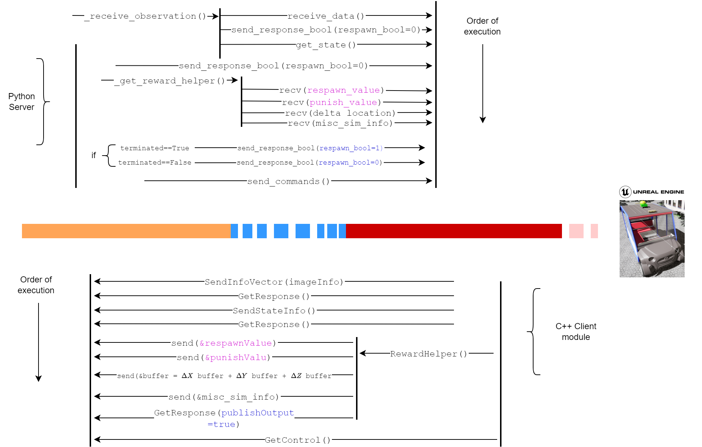

# ms-thesis-rrlab
My master thesis carried out at the Robotics Research Lab at RPTU Kaiserslautern-Landau titled: Reinforcement Learning on Sensor Data and Reaction Grid Maps.
I will be adding the code gradually. Due to proprietary reasons, .cpp and .h files that are related to finroc are not included. If this code should be needed, please contact me, I will have to consult the AG Robotersysteme. 

## Project

  <UE5FinRl>
    <ul>
      <li>UE5FinRl/</li>
      <li>
        <ul style="list-style-type: none; padding-left: 20px;">
          <li>gFinRlUE5DMapInterface.cpp</li>
          <li>gFinRlUE5DMapInterface.h</li>
          <li>make.xml</li>
          <li>mFinRlSocket.cpp</li>
          <li>mFinRlSocket.h</li>
          <li>pDMapInterface.cpp</li>
          <li>
            AutoBusEnv/
            <ul style="list-style-type: none; padding-left: 20px;">
              <li>AutoBusEnvContActionSpace.py</li>
              <li>AutoBusEnvMultidiscActionSpace.py</li>
              <li>AutoBusEnvMultidiscActionSpaceUnstacked.py</li>
              <li>test_env.py</li>
              <li>train.py</li>
              <li>eval_autobus_v3.py</li>
              <li>eval_autobus_v4_taf.py</li>
              <li>
                eval_data/
                <ul style="list-style-type: none; padding-left: 20px;">
                  <li>eval_postprocess.py</li>
                  <li>csv1.csv</li>
                  <li>...</li>
                </ul>
              </li>
              <li>export.py</li>
              <li>inference.py</li>
              <li>
                onnx_models/
              </li>
              <li>plot.py</li>
              <li>PyServer.py</li>
              <li>
                runs/
                <ul style="list-style-type: none; padding-left: 20px;">
                  <li>
                    ppo/
                    <ul style="list-style-type: none; padding-left: 20px;">
                      <li>
                        experiment_1/
                      </li>
                      <li>
                        experiment_2/
                      </li>
                      <li>...</li>
                    </ul>
                  </li>
                  <li>
                    vis/
                    <ul style="list-style-type: none; padding-left: 20px;">
                      <li>export_svg.py</li>
                    </ul>
                  </li>
                </ul>
              </li>
            </ul>
          </li>
        </ul>
      </li>
    </ul>
  

## Media
Campus

Networking

  </ul>

